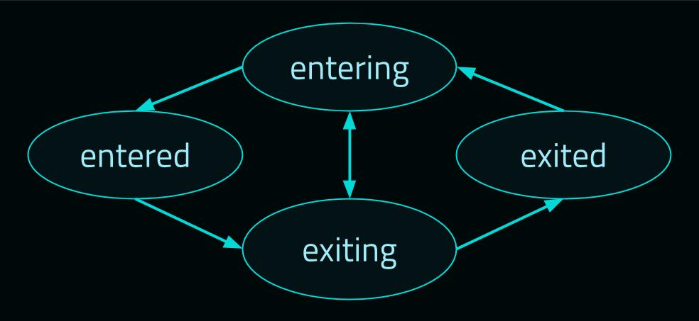
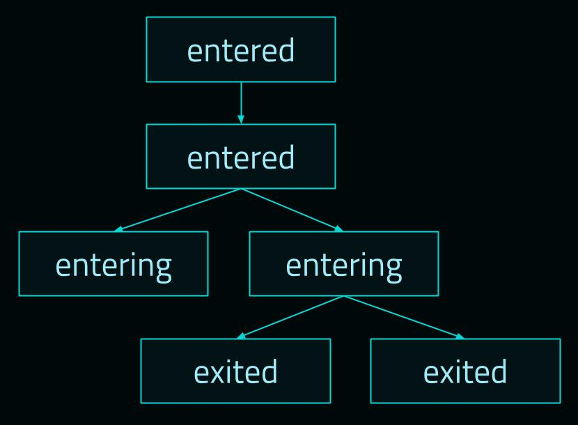
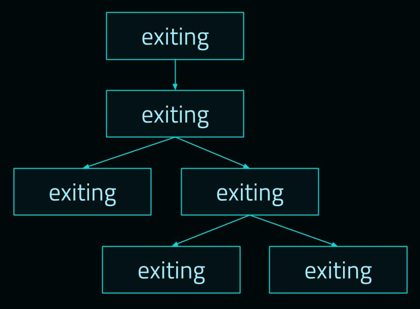

Arwes futuristic science fiction user interfaces have assembling/creating/building
and disassembling/destructing/demolishing user experiences. To manage this workflow,
[systems](../systems/systems.md) have UI states according to the application
and user [events](../events/events.md). These states determine the nodes design,
animations, and sounds configuration changes.

Since the state transitions from one state to another throughout the user
experience, it is referred as the system "flow". Normally, the flow goes from
one node to another in the system hierarchy.

An UI mounted node in a system can have 4 states:

- **Exited**: Transitioned out. If a node is animated, this is its initial
state. If a node is animated and it is going to be removed, this is its final state.
The node component should be invisible.
- **Entering**: Transitioning in. The node component is being assembled to be visible.
- **Entered**: Transitioned in. If a node component is not animated, this will be
always its state. The node component should be completely visible.
- **Exiting**: Transitioning out. The node component is being disassembled to be
invisible to the user.

## Transitions

Due to [events](../events/events.md), a node can have the following state transitions:

- From **exited** to **entering** when assembling.
- From **entering** to **entered** when assembled.
- From **entering** to **exiting** when in the middle of assembling, it is
cancelled so the flow is reversed.
- From **entered** to **exiting** when disassembling.
- From **exiting** to **exited** when disassembled.
- From **exiting** to **entering** when in the middle of disassembling, it is
cancelled so the flow is reversed.

Other transitions should not be permitted.

When an node transitions in, it should be assembled. It should feel as being
created part by part. A simple line will start as a point and get its final length
over a short period of time. Opacity can be used from 0 to 1 while animating but
should last very short in the beginning of the animation.

When a node transitions out, it should be disassembled. It should feel as if it
is being unmounted part by part. A simple line will shrink until it is a point
in a short period of time. Opacity can be used from 1 to 0 while animating,
but should last very short at the end of the animation.

Before a node component is removed or unmounted from the UI, it should be
completely disassembled.

Nodes components transitioning in and out can have a sound effect lasting the
time the animations take.

The animations and sounds in the transitions should attrach minimum attention from
the user. Just enough to let the user know there is a change in the application.

When a system transitions in, nodes should transition in by their order of
hierarchy. From parent nodes to children nodes. For example, first backgrounds,
then structural frames, then containers, and finally content. All nodes in
the same level start transitioning in at the same time and should take the
same duration.

When a system transitions out, all nodes regardless of their level in the hierarchy,
should start transitioning out at the same time and should take the same duration.

All nodes in a system should support being animated or not. A non-animated node
should not have transition animations nor sounds. The nodes components should
handle all the design styling for each case.

By default, a node should have enabled animations and sounds if configured.
These settings are inherited by children nodes.

A system can take as many levels as needed. It is recommended to have as few as
possible with short transition durations.

## Persistency

Normally, a node component will take short durations in the transitions and long
durations assembled (or disassembled if needed), as expected from any UI application.

Once a system is assembled, it can run randomly subtle passive animations on its
nodes regularly with very optional sounds or background sounds such as music.

Lines in a rectangular container can glow momentary in a system. A background
can be animated the whole time with subtle changes, and low dim music can be
played in the duration of the system.

But these animations and sounds should not be intrusive. User should not be
distracted from primary content.

## Performance

The nodes in a system can all be mounted at start time with animations and sounds
enabled. They will be created with exited state. Then the flow can start from
the root node to assemble the nodes components.

A node can also exist in the system in exited state, not unmounted for certain
purposes.

This situation can out of control if multiple expensive node components are exited
but not unmounted. If they are not assigned tasks in this state, they should be
removed to prevent zombie components wasting the machine resources.

Since a rich Arwes system may even involve hundreds of thousands of components,
a special focus on performance is required when developing Arwes applications.
